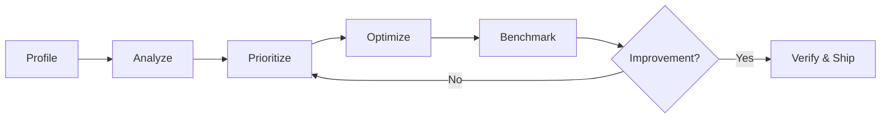

# Performance Optimization Skill

## When to Use

- User provides profiling data (pprof, flamegraph, py-spy, Chrome/Dart DevTools)
- User asks to analyze/optimize performance of a component
- Benchmark regression detected
- After deploying a feature touching a hot path

## Core Methodology



### Step 1: Profile
Collect profiling data via language-appropriate tool. Load relevant `languages/*.md`. **Output:** raw profile.

### Step 2: Analyze
1. **Focus on `cum` (cumulative):** total resources consumed by a function AND its callees — finds expensive flows.
2. **Contextualize `flat`:** function-only cost. If a runtime function (GC, malloc, syscall) has high flat time, trace UP to user code that triggered it.
3. **Ignore runtime noise:** scheduler/GC overhead always appears. Note GC pressure, don't tune scheduler.
4. **Separate benchmark artifacts from production cost:** test harness allocations don't exist in prod.

**Output:** `docs/research_logs/{component}-perf-analysis.md`.

### Step 3: Prioritize

Rank by **impact/risk ratio**:

| Priority | Criteria |
|---|---|
| Do first | Low risk, high impact (caching, pre-allocation, fast-reject) |
| Do second | Medium risk, high impact (library swap, algorithm change) |
| Do last | High risk, high impact (major refactor, custom implementation) |
| Skip | Any risk, low impact (micro-optimization below noise floor) |

**Rule:** If a fix takes >1 day AND saves <20% on hot path, defer.

### Step 4: Optimize
One fix at a time:
1. Write tests FIRST (TDD: Red → Green → Refactor)
2. Implement fix
3. Run all tests — verify no regression
4. Benchmark immediately

**Never batch multiple optimizations into one commit.** Each fix must be independently verifiable and revertable.

### Step 5: Benchmark
Compare before/after with **identical benchmark configuration** (same `-benchtime`, `-count`, machine load). Report `ns/op`, `B/op`, `allocs/op`.

### Step 6: When to Stop
- Remaining CPU is in hardware-optimized assembly (AES-NI, P-256, SIMD)
- Remaining allocations are language runtime (GC, goroutine stacks, HTTP internals)
- Fix requires custom implementation of well-audited library — security/maintenance risk outweighs gain
- Measured improvement <5% and within benchmark noise

---

## Optimization Pattern Catalog

Generic, language-agnostic. Apply when profiling shows the symptom.

### Pattern: Result Caching
**Symptom:** Same expensive computation repeated with identical inputs (crypto verify, JSON parse, regex compile).
**Fix:** Cache by input hash; bounded LRU with TTL.
**Safety invariant** (security-sensitive results — auth tokens, perm checks):
- ALWAYS re-validate expiry/revocation on cache hit
- ALWAYS bound cache size (DoS protection)
- ALWAYS set TTL shorter than credential validity

### Pattern: Pre-allocation
**Symptom:** High `allocs/op` from repeatedly constructing same objects (option structs, config slices, header maps).
**Fix:** Build once at init, share read-only. Safe for concurrent use if immutable after construction.

### Pattern: Fast-Reject / Short-Circuit
**Symptom:** Expensive validation runs for clearly invalid inputs.
**Fix:** Cheap structural pre-check before expensive path (string length before regex, delimiter count before parse, content-type before deserialize).

### Pattern: Library Swap
**Symptom:** High allocation/CPU in third-party parsing/serialization.
**Fix:** Replace with lower-allocation library (manual scanners vs `encoding/json.Decoder`, zero-copy parsing, arena allocation).
**Safety invariant** (security-critical libs — JWT, TLS, crypto):
- Explicitly restrict accepted algorithms (prevent algorithm confusion)
- Verify replacement is well-audited and maintained
- Run full existing test suite — no behavioral change

### Pattern: Pooling
**Symptom:** High GC pressure from many short-lived uniform objects.
**Fix:** Object pool (sync.Pool, Java pool, Rust arena).
**Caveat:** Only effective for uniform-size objects with clear acquire/release lifecycle. Misuse causes subtle bugs.

### Pattern: Batching
**Symptom:** Many small I/O ops (DB queries, HTTP calls, file writes) dominate wall-clock.
**Fix:** Batch INSERT, pipeline Redis, buffer writes.

### Pattern: Artifact Partitioning by Change Frequency
**Symptom:** Small change invalidates large cached artifact (JS bundle, Docker image, binary), forcing full re-download/rebuild.
**Fix:** Partition by change frequency:
- **Stable layer:** dependencies, vendor libs, base images
- **Volatile layer:** application code

**Examples:** Vite `manualChunks`/Webpack `splitChunks`; Docker multi-stage with `COPY go.mod` + `RUN go mod download` BEFORE `COPY . .`; monorepo packages by change frequency.
**Safety invariant:** Total artifact size stays same/slightly increases. Benefit is on **repeat consumption**.
**When NOT to apply:** One-shot artifacts with no caching benefit.

### Pattern: Dependency Discovery Parallelization
**Symptom:** Sequential resource discovery creates waterfalls (download → parse → discover next → ...).
**Fix:** Declare dependencies as early as possible for parallel fetch; use explicit hints to bypass sequential chains.
**Examples:** Browser `<link rel="preconnect">`, move CSS `@import` to HTML `<link>`; Go `go mod download`; DB pool warm-up at startup; DNS `dns-prefetch`.
**Safety invariant:** Only pre-declare resources you WILL use. Unused preconnects/prefetches waste resources.

### Pattern: Concurrent-Fetch Dedup
**Symptom:** Two identical API calls fired simultaneously when multiple components mount and each calls the same fetch.
**Fix:** Loading-state guard (semaphore) at store/service layer:

```
async function fetchData() {
    if (isLoading) return    // ← drop duplicate in-flight request
    isLoading = true
    try { data = await api.getData() }
    finally { isLoading = false }
}
```

**When to apply:** Same data store used by co-mounted components (nav bar + page both calling `fetchProfile()` on mount).
**Caveat:** Simple semaphore, not request dedup. For advanced use, use a request dedup cache (TanStack Query `staleTime`).

---

## Anti-Patterns (Things NOT to Do)

1. **Don't optimize runtime internals.** If `runtime.mallocgc`/`runtime.gcBgMarkWorker` is high, fix USER CODE — don't tune GC directly.
2. **Don't replace battle-tested crypto with custom implementations.** ECDSA/RSA ceiling is in the math.
3. **Don't optimize on gut feeling.** Always profile first.
4. **Don't combine multiple optimizations in one commit.** Can't isolate regressions.
5. **Don't disable security features for performance.** Algorithm restriction, input validation, expiry checks are non-negotiable.
6. **Don't profile without a stable baseline.** Reproducible baseline required for meaningful before/after.

---

## Language Modules

| Module | Use when |
|---|---|
| [Go](languages/go.md) | Go services, APIs, CLI |
| [Rust](languages/rust.md) | Rust binaries, libraries |
| [Python](languages/python.md) | Python services, CLI, data pipelines |
| [Frontend](languages/frontend.md) | Web frontends (bundle, rendering, network) |

> **Contributing:** After a perf session, extract generalizable patterns from `docs/research_logs/` into this catalog. Project-specific details stay in the log.

## Profiling Scripts

| Script | Purpose |
|---|---|
| [go-pprof.sh](scripts/go-pprof.sh) | Extract Go pprof CPU/heap into agent-readable markdown |
| [frontend-lighthouse.sh](scripts/frontend-lighthouse.sh) | `lighthouse` (Core Web Vitals, needs Chrome) or `bundle` (Vite chunk analysis) |
